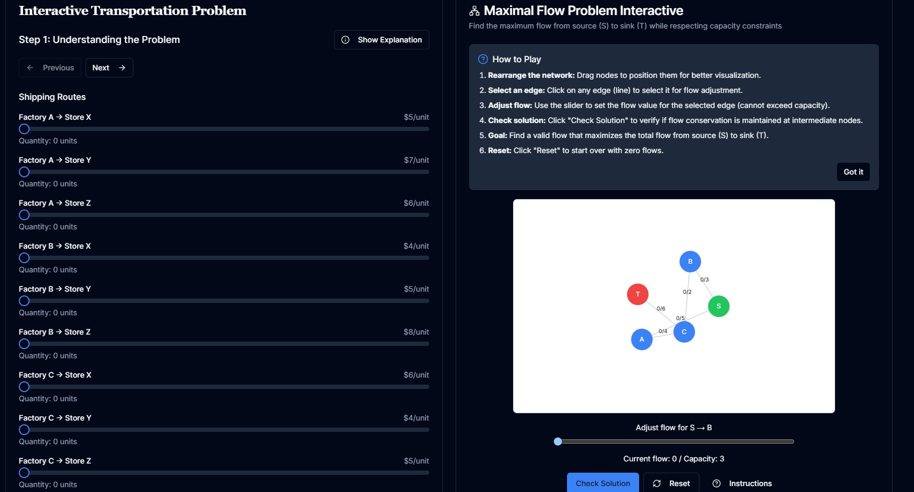

# 📚 Linear and Nonlinear Programming

<div align="center">
  
  
  
  
  
</div>

<br />

<div align="center">
  <h1>🚀 Interactive Learning Platform for Optimization Techniques</h1>
  <p><em>Master linear and nonlinear programming through interactive tutorials, visualizations, and real-world applications</em></p>
</div>

<br />

<div align="center">
  <a href="#features">Features</a> •
  <a href="#roadmap">Roadmap</a> •
  <a href="#getting-started">Getting Started</a> •
  <a href="#contributing">Contributing</a> •
  <a href="#license">License</a>
</div>

<br />

<div align="center">
  
</div>

## ✨ Features

- **📖 Comprehensive Content**: Detailed chapters covering linear programming, nonlinear programming, and optimization techniques
- **🎮 Interactive Learning**: Hands-on games and simulations to reinforce concepts
- **📊 Visualizations**: Dynamic graphs and charts to illustrate complex mathematical concepts
- **🧩 Problem-Solving**: Real-world applications and case studies
- **🏆 Achievement System**: Track your progress and earn badges as you learn
- **🌙 Dark/Light Mode**: Comfortable reading experience in any environment
- **📱 Responsive Design**: Learn on any device, from desktop to mobile

## 🗺️ Roadmap

### Phase 1: Core Content (Current)
- [x] Basic linear programming concepts
- [x] Simplex method implementation
- [x] Duality theory
- [x] Transportation problem
- [x] Diet problem
- [x] Manufacturing problem
- [x] Warehousing problem
- [x] Maximal flow problem

### Phase 2: Advanced Topics (Q3 2023)
- [ ] Nonlinear programming fundamentals
- [ ] Convex optimization
- [ ] Gradient descent methods
- [ ] Interior point methods
- [ ] Integer programming
- [ ] Branch and bound algorithms
- [ ] Dynamic programming

### Phase 3: Interactive Features (Q4 2023)
- [ ] User accounts and progress tracking
- [ ] Collaborative problem-solving
- [ ] Custom problem creation
- [ ] Solution sharing and discussion
- [ ] Performance analytics

### Phase 4: Educational Integration (Q1 2024)
- [ ] Instructor dashboard
- [ ] Assignment creation and grading
- [ ] Student progress monitoring
- [ ] Integration with LMS platforms
- [ ] API for educational institutions

### Phase 5: Advanced Applications (Q2 2024)
- [ ] Machine learning optimization
- [ ] Financial portfolio optimization
- [ ] Supply chain optimization
- [ ] Energy systems optimization
- [ ] Healthcare resource allocation

## 🚀 Getting Started

### Prerequisites

- Node.js 18.0 or higher
- npm or yarn

### Installation

1. Clone the repository
   ```bash
   git clone https://github.com/zhutoutoutousan/linear-and-nonlinear-programming.git
   cd linear-and-nonlinear-programming
   ```

2. Install dependencies
   ```bash
   npm install
   # or
   yarn install
   ```

3. Run the development server
   ```bash
   npm run dev
   # or
   yarn dev
   ```

4. Open [http://localhost:3000](http://localhost:3000) in your browser

## 🤝 Contributing

We welcome contributions from mathematicians, educators, developers, and anyone passionate about optimization techniques! Here's how you can help:

### Ways to Contribute

1. **Content Creation**
   - Add new chapters or sections
   - Create interactive examples
   - Develop visualizations for complex concepts
   - Write tutorials or case studies

2. **Code Improvements**
   - Fix bugs
   - Improve performance
   - Add new features
   - Enhance accessibility

3. **Documentation**
   - Improve existing documentation
   - Add comments to code
   - Create user guides
   - Write blog posts about the platform

4. **Testing**
   - Report bugs
   - Suggest improvements
   - Test on different devices/browsers
   - Provide feedback on user experience

### Contribution Process

1. Fork the repository
2. Create a new branch (`git checkout -b feature/amazing-feature`)
3. Make your changes
4. Commit your changes (`git commit -m 'Add some amazing feature'`)
5. Push to the branch (`git push origin feature/amazing-feature`)
6. Open a Pull Request

### Coding Standards

- Follow the existing code style
- Write clear, commented code
- Include tests for new features
- Update documentation as needed

## 📝 License

This project is licensed under the MIT License - see the [LICENSE](LICENSE) file for details.

## 🙏 Acknowledgments

- [Next.js](https://nextjs.org/) - The React framework
- [Tailwind CSS](https://tailwindcss.com/) - Utility-first CSS framework
- [Shadcn UI](https://ui.shadcn.com/) - Re-usable components
- [KaTeX](https://katex.org/) - Fast math typesetting
- [D3.js](https://d3js.org/) - Data visualization library

## 💬 Contact

Have questions or suggestions? We'd love to hear from you!

- **GitHub Issues**: [Report a bug or request a feature](https://github.com/zhutoutoutousan/linear-and-nonlinear-programming/issues)
- **Email**: tian.shao@namelos.xyz

## ☕ Support the Project

If you find this project helpful, consider supporting its development:

<div align="center">
  
  <p>Scan to support via Alipay</p>
</div>

---

<div align="center">
  <p>Made with ❤️ by the Linear and Nonlinear Programming Team</p>
</div> 